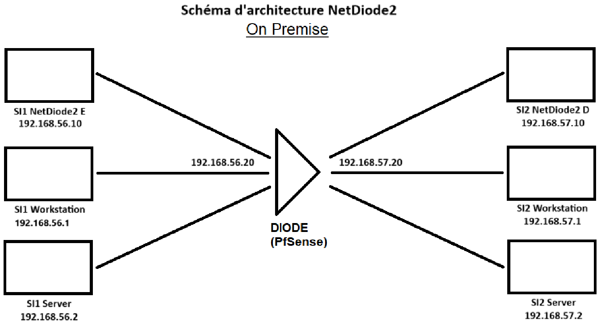

# GhostTransfer
> Un projet révolutionnaire
## Objectif
Simuler un flux de données unidirectionnel entre deux machines virtuelles (A et B) via une netdiode, en utilisant pfSense comme passerelle pour gérer les flux et appliquer des transformations ou des filtres sur les paquets de données.

## Contributeurs
Projet réalisé par 6 étudiants
